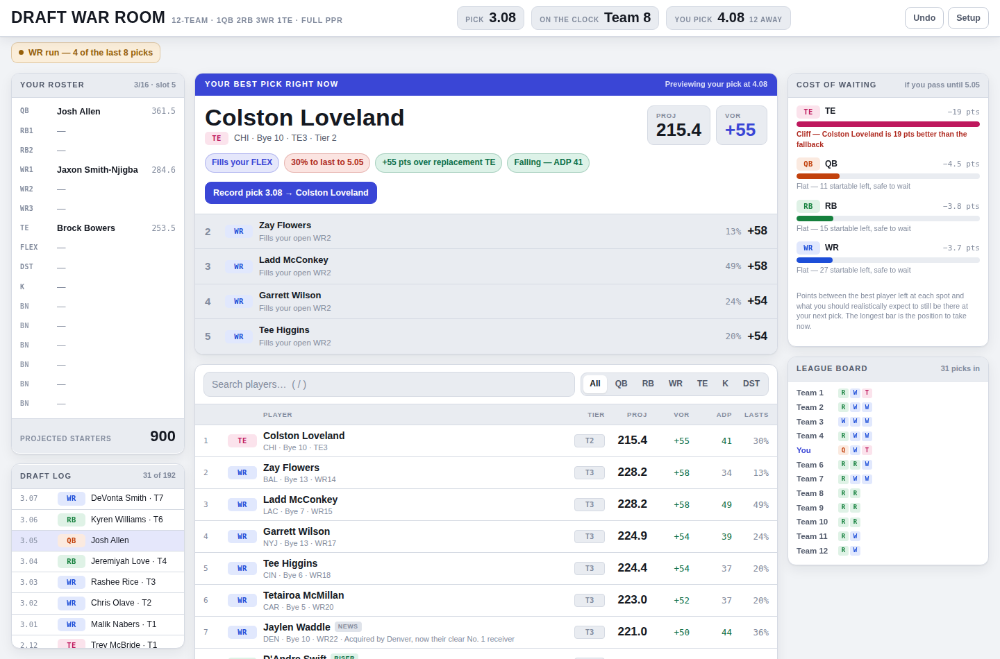

# Draft War Room

A live snake-draft board for full-PPR fantasy football. You tap each player as
they come off the board; it re-ranks everyone left after every pick using value
over replacement, positional scarcity, your roster needs, and the odds a given
player survives to your next turn.

One HTML file, no build step required to use it. The only runtime network
calls are headshot images (loaded from Sleeper's CDN when you open a
player's card) — everything else, including the whole draft engine, is
self-contained and works offline.



## Quick start

Open `index.html` in a browser. That's the whole thing.

To rebuild it from source:

```bash
npm run build      # inject the dataset into the template
npm test           # run the engine suite in real Chromium (needs playwright)
npm run tune       # search the scoring constants against the backtest
npm run serve      # http://localhost:8080
```

## Why not just use a cheat sheet

A printed ranking can't answer the only question that matters mid-draft: *given
what's already gone and what I already have, who should I take right now?*

Four things move the recommendation after every pick.

**Value over replacement, computed live.** A player's worth is his projection
minus what you'd get at that position anyway. "Anyway" is the last startable
player at that spot given what the *whole league* still needs to fill — so the
bar moves as rosters fill up. This is why the top QB projects for more raw
points than any running back but isn't the top pick in a 1QB league: eleven
other quarterbacks project within ~60 points of him, and no running back has
that kind of company.

**Whether he'll still be there.** Every player gets a survival probability to
your *next* pick, modeled from ADP with wider uncertainty deeper in the draft
and conditioned on him being available now. A player who's 13% to make it back
to you is worth taking over an equally valuable player who's 80%.

**What waiting costs.** For each position the board computes the expected best
player still available at your next turn, and subtracts. That difference — not
raw value — is what tells you which position to take *now*. When the tight end
column reads −19 and everything else reads −4, you take the tight end even
though three receivers have higher raw value.

**Your roster and the room.** Picks are attributed to teams by snake order, so
the board reconstructs all twelve rosters and knows real positional demand, not
an assumption. Your own unfilled starting slots weight the score; a third
quarterback is discounted to near zero; kicker and defense stay suppressed until
the last rounds and then become mandatory.

It also flags positional runs, tier cliffs, bye-week stacking, and players
falling well past their ADP.

Tapping a player opens their card — photo, stats, news, and full 2026
schedule — with
a Draft button inside, rather than drafting immediately. Two exceptions stay
one-tap for speed during a live draft: the big recommendation button, and
pressing **Enter** in search to draft the top result.

## Is it actually better

`npm test` simulates complete drafts from all twelve slots against a competent
ADP drafter — one that respects roster caps and always fields a legal starting
lineup.

```
slot  1: engine 2176  vs  ADP 2070   +106
slot  2: engine 2165  vs  ADP 2036   +128
...
average edge: +121.0 projected starter points
```

The engine wins from every slot, averaging **+121 projected starter points**
over a season. Just over seven points a week.

Worth being precise about what that is and isn't. It's a measure against one
scripted opponent, on one set of projections, with no in-season management. It
is not a claim about your league. The first version of this baseline never
drafted a kicker or defense, which flattered the engine to +273; that was a bug
in the test, and +121 is the honest number.

The suite has 58 assertions covering snake order, replacement-level behavior
under runs and droughts, survival math, roster-need weighting, endgame lineup
legality, dataset integrity, and render output.

The scoring constants that shape the recommendation (how hard to discount a
backup QB, a second TE, an extra RB past your bench needs, and so on) live in
`src/template.html`'s `TUNE` object and used to be hand-picked. `npm run tune`
(`scripts/tune.mjs`) now searches them by coordinate ascent against this same
backtest — nudging each constant up and down, keeping any move that raises the
average edge without lowering the win count or producing an illegal roster
(e.g. two DSTs). It's how the current constants were found, up from a +113.7
hand-picked baseline.

## Layout

```
index.html            the built page — this is the deliverable
src/template.html     source: markup, styles, and the draft engine
data/sources.py       raw scraped ADP, projections, byes, schedule, camp news
data/names.py         shared name normalization (ADP, projections, news, live status)
data/build.py         merges those into players.json (consensus, tiers)
data/fetch_news.py    pulls live injury status and photo ids from Sleeper's API
data/live_status.json auto-refreshed output of fetch_news.py (see below)
data/photos.json      auto-refreshed name -> Sleeper player_id, for headshots
data/players.json     the built dataset — 307 players
data/schedule.json    2026 weekly schedule, by team (18 weeks, 32 teams)
scripts/build.mjs     injects the dataset into the template
scripts/tune.mjs      searches TUNE's scoring constants against the backtest
test/backtest.js      the engine-vs-ADP backtest, shared by tests and the tuner
test/assertions.js    the assertion suite (runs inside the page)
test/run.mjs          boots the built page in Chromium and runs it
```

`src/template.html` carries a `/*PLAYERS_JSON*/` placeholder. The build fills it
and writes two outputs: `index.html` (standalone, for Pages or a local browser)
and `dist/artifact.html` (a bare fragment for Claude Artifacts, which supplies
its own page skeleton).

## Updating the data

Everything the board knows lives in `data/sources.py` as plain pipe-delimited
text, with the source of each block noted in a comment. Edit it and rebuild:

```bash
python3 data/build.py    # re-merge, re-tier, rewrite players.json
npm run build            # re-inject into the page
```

`build.py` handles name normalization across sources (suffixes, initials,
nicknames), averages the two ADP lists into a consensus, interpolates
projections for anyone listed in one source but not the other, and clusters each
position into tiers with 1-D k-means. It asserts that tiers come out monotonic
down the ranking, so a bad merge fails the build instead of shipping a lie.

To adapt to a different season, replace the three data blocks in `sources.py`
with current numbers in the same format. Nothing else needs to change.

### Live injury status

`data/sources.py`'s `NEWS` block is still hand-curated prose, and it always
wins — that's real judgment a script can't replace. But it goes stale as the
season moves. `.github/workflows/refresh-news.yml` runs daily, pulling
current `injury_status` for every rostered QB/RB/WR/TE from
[Sleeper's free player API](https://docs.sleeper.com/), mapping it to a tag
(`Questionable`→`RISK`, `Doubtful`/`Out`/`IR`/`PUP`/`NA`/`Sus`→`OUT`), and
writing `data/live_status.json`. `build.py` then fills in any player who
doesn't already have a manual `NEWS` entry — so a hand-written note about,
say, a rising backup never gets clobbered by a terser auto-generated one.
Auto-generated notes are labeled `(auto, via Sleeper)` so it's always
obvious which is which.

The workflow only commits and pushes if the *full test suite* still passes
against the merged data — a bad fetch or a mapping bug fails the run
instead of shipping bad data to the live site. Run it by hand with:

```bash
python3 data/fetch_news.py   # writes data/live_status.json
python3 data/build.py        # merges it in (manual NEWS still wins)
npm run build
```

### Scoring formats

The board ships tuned for full PPR, 1QB, 12 teams. **Setup** in the UI changes
team count, your slot, bench size, and every starting slot including superflex
(set `QB` to 2), and the whole model recomputes — replacement levels, demand,
and survival all follow.

Scoring itself is baked into the projections. Half-PPR or standard means
swapping the `PROJ` block in `sources.py` for that format's numbers.

## Data provenance

The dataset was assembled in **August 2026** from public sources: ADP as a
consensus of two independent lists, season projections from a third, 2026 bye
weeks, and roughly seventy verified late-August camp and injury notes.
Attribution for each block is in the comments at the top of `sources.py`. ADP
and projections are that August snapshot and don't move on their own; injury
status is the exception — it refreshes daily from Sleeper (see
[Live injury status](#live-injury-status) above).

Two caveats worth carrying forward. Projections are one provider's opinion, not
fact — the engine is only as good as they are. And this data was gathered for
personal use; check the terms of any source before redistributing it in a public
repo.

## Deploying

`.github/workflows/pages.yml` publishes `index.html` to GitHub Pages on every
push to `main`. Enable it under **Settings → Pages → Source → GitHub Actions**.

`.github/workflows/test.yml` runs the suite on push and PRs, and fails if
`players.json` is out of sync with `sources.py`.

## License

MIT — see [LICENSE](LICENSE). The code is MIT; the player data is not mine to
license, see the provenance note above.
